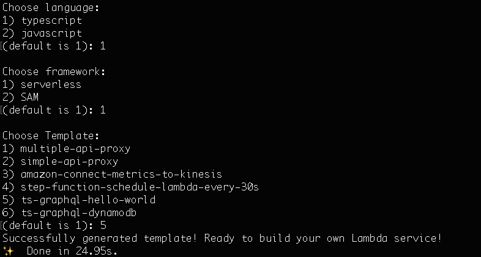

# aws-lambda-template-generator 🤟💀🤟

CLI tool for generating AWS Lambda function template. It will create a folder with files for whichever lambda function example you choose (see the lambda function options in the table below).

The project is still very new. We are looking for collaborators who can enrich our lambda template selections. Come to our git repo and contribute to the project!

At the moment, all the templates use [serverless](https://www.serverless.com/). We are working towards adding different frameworks in the future. As for language support, we currently have TypeScript and JavaScript. We are planning to add more templates.

## List of lambda functions ✨

Template Name                            | Languages              | Framework     | Use Case                                                                               | 
---------------------------------------- | ---------------------- | ------------- | -------------------------------------------------------------------------------------- |
multiple-api-proxy                       | TypeScript             | Serverless    | Integration. API proxy, get and post, single endpoint, multiple paths with API gateway |
simple-api-proxy                         | TypeScript, JavaScript | Serverless    | Integration. Basic example with API gateway                                            |
amazon-connect-metrics-to-kinesis        | TypeScript             | Serverless    | Real-time data ingestion for Amazon connect metrics to Kinesis                         |
step-function-schedule-lambda-every-30s  | TypeScript, JavaScript | Serverless    | Scheduling lambda function faster 60s (faster than CloudWatch Event)                   |


## Get Started 🏄🏻‍♀️

Install the module globally. It will add the command generate-lambda-template.

```bash
npm i -g aws-lambda-template-generator
```

Then, run the generate-lambda-template command with the name of your project. Default project name is my-lambda if you don't pass the argument.

```bash
generate-lambda-template my-new-lambda-function
```

Follow the prompt.



